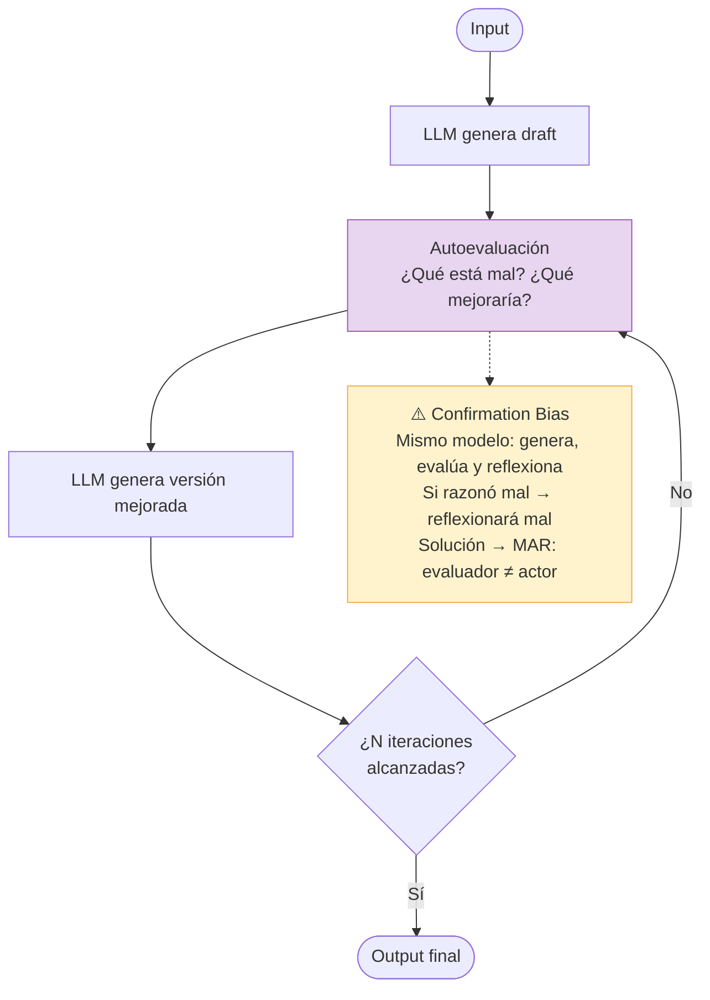
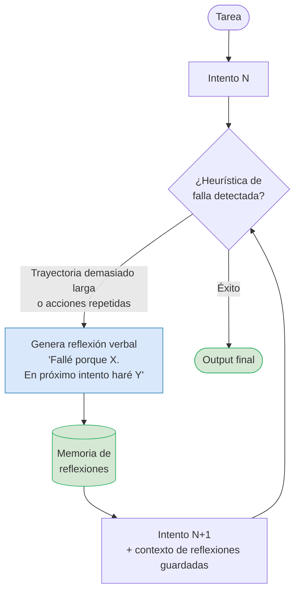
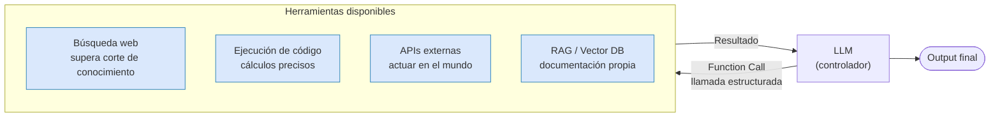
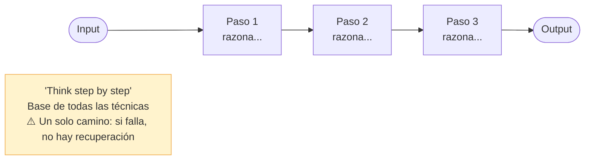
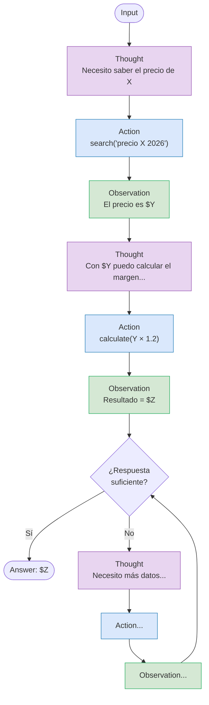
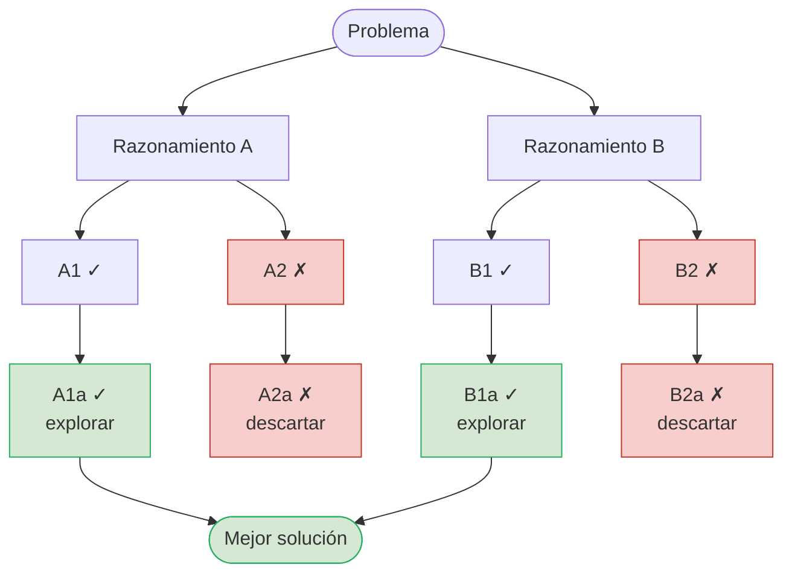
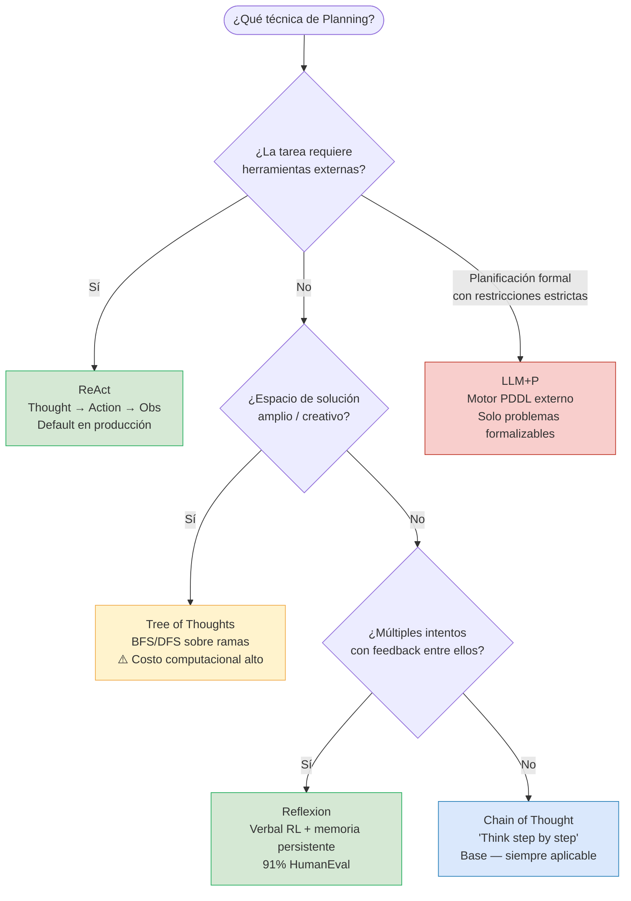
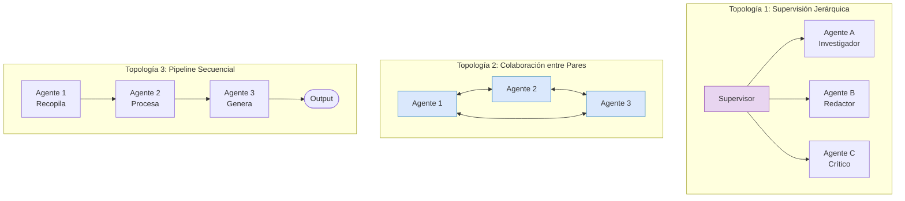
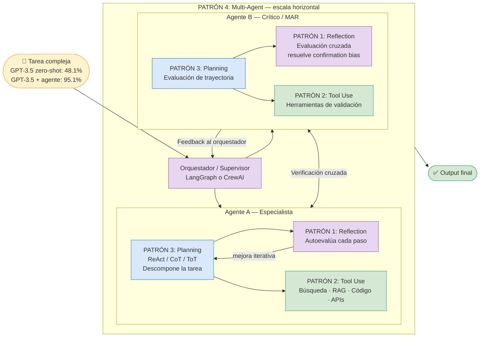
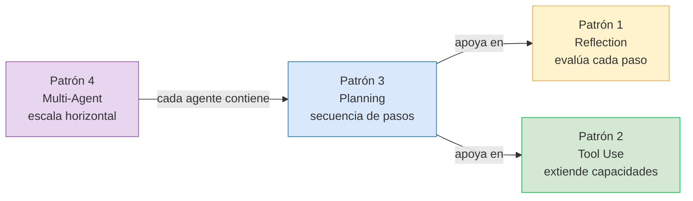

# Agentic Design Patterns — Diagramas Mermaid

> Visualización completa de los 4 patrones de Andrew Ng y su composición unificada.  
> Ver explicación textual en [[concepts/agentic-design-patterns]].

---

## Patrón 1 — Reflection

### Bucle básico de autorreflexión

### Variante: Reflexion — Shinn et al. (91% HumanEval)

---

## Patrón 2 — Tool Use

---

## Patrón 3 — Planning

### Chain of Thought (CoT) — razonamiento lineal

### ReAct — el patrón default en producción

### Tree of Thoughts (ToT) — exploración de múltiples caminos

### Árbol de decisión: ¿qué técnica de Planning usar?

---

## Patrón 4 — Multi-Agent

**Ventajas sobre Reflection solo:**
- **Especialización**: cada agente optimizado para su rol
- **Paralelismo**: tareas independientes corren simultáneamente
- **Verificación cruzada**: elimina el confirmation bias del Patrón 1

---

## Diagrama Unificado — Composición de los 4 patrones

---

## Regla de composición

**Orden de adopción recomendado:**
1. **Reflection** — más barato, mayor ROI inicial
2. **Tool Use** — cuando se necesitan datos externos
3. **Planning/ReAct** — cuando la tarea es multi-step con herramientas
4. **Multi-Agent** — cuando la especialización o el paralelismo lo justifican

---

## Conexiones

- [[concepts/agentic-design-patterns]] — explicación textual completa de los 4 patrones
- [[concepts/planning]] — detalle de cada técnica de planning
- [[concepts/llm-agents]] — arquitectura base: Planning + Memory + Tools (Weng)
- [[reflexion-paper]] — fuente del 91% HumanEval con Reflexion
- [[concepts/multi-agent-frameworks]] — LangGraph vs CrewAI implementando Multi-Agent
- [[analyses/sdlc-ia-flujo-recomendado]] — aplicación de los patrones a cada fase del SDLC
